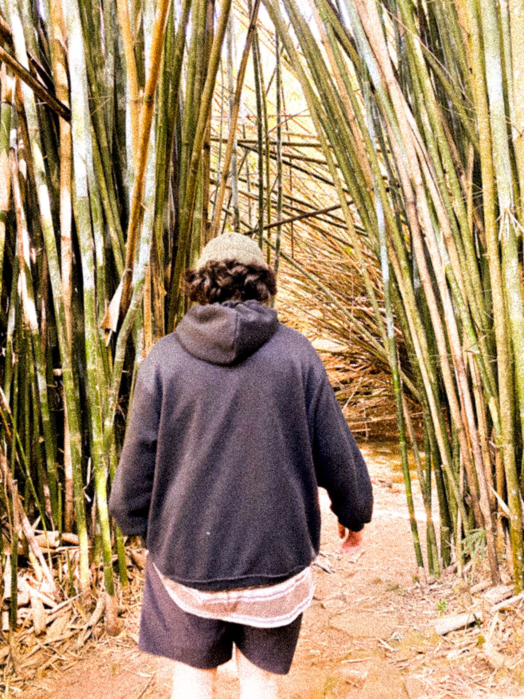

   

### Opa intruso 👽, me chamo Caio!

- ✌️ Cursando Sistemas de Informação, Unilasalle-RJ.

- ⛓️ Estudando HTML, CSS e JavaScript.
  
- 🦇 Buscando ser um programador melhor.
  
- 👁️ Faço músicas!!
  
#
 
 

  
   

 
 
 
 
 
 
 
 
 
 
 

  

 
    
 
    <h1 align="left">Conhecimento</h1>
    
    
    
    
     
     
    
    
    
    
  

  

     
     
     
     
    
    <h1 align="right">Contato</h1>
    
     
     
     
    
  

    
  

 
